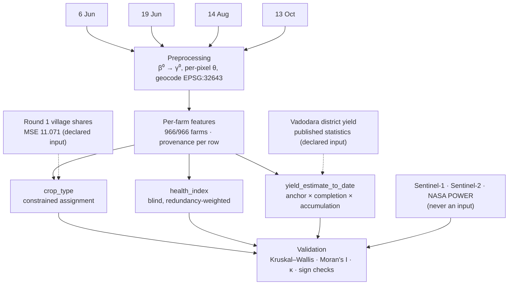

<h1 align="center">Dasymetric Mapping of Village Crop Statistics to Parcel Level from X-band SAR</h1>

<p align="center">
  <em>From four Capella X-band scenes and nothing else — crop type, a health index, and yield-to-date for 966 farms that have no ground truth.</em>
</p>

<p align="center">
  <strong>Round 1 fixed this village's crop-area shares exactly, and district statistics fix its yield level exactly — but neither exists per farm. This pipeline holds both aggregates and lets X-band SAR supply only the variation inside them, then tests every derived number against two sensors it was never allowed to read.</strong>
</p>

<p align="center">
  
  
  
  
  
  
</p>

<p align="center">
  <strong>Report:</strong> <a href="docs/REPORT.md">docs/REPORT.md</a> (or the rendered <code>upload/REPORT.pdf</code>)
  &nbsp;·&nbsp;
  <strong>Kaggle writeup guide:</strong> <a href="docs/KAGGLE_WRITEUP.md">docs/KAGGLE_WRITEUP.md</a>
  &nbsp;·&nbsp;
  <strong>Method diagram:</strong> <a href="docs/figures/gallery_00_method_overview.png">gallery_00_method_overview.png</a>
</p>

---

## 👥 Team GDHTM

**ANRF AISEHack 2.0, Round 2** — SAR Crop Health & Yield Estimation, Sokhda village, Vadodara district, Gujarat.

<table align="center">
  <tr>
    <td align="center" width="20%"><strong>Yash Sorathiya</strong></td>
    <td align="center" width="20%"><strong>Jenish Sorathiya</strong></td>
    <td align="center" width="20%"><strong>Yajurshi Velani</strong></td>
    <td align="center" width="20%"><strong>Mahi Parmar</strong></td>
    <td align="center" width="20%"><strong>Aayush Pandya</strong></td>
  </tr>
</table>

---

## 📋 Table of Contents

- [Problem Statement](#-problem-statement)
- [What This Pipeline Does](#-what-this-pipeline-does)
- [Architecture](#️-architecture)
- [The One Rule: What Feeds a Deliverable, and What Only Tests One](#-the-one-rule-what-feeds-a-deliverable-and-what-only-tests-one)
- [Libraries & Tech Stack](#️-libraries--tech-stack)
- [Decisions, and What They Cost](#-decisions-and-what-they-cost)
- [Validation & Findings](#-validation--findings)
- [What Failed, Reported as Failures](#-what-failed-reported-as-failures)
- [Project Structure](#-project-structure)
- [Reproducing the Submission](#-reproducing-the-submission)
- [Submission Contents](#-submission-contents)

---

## 🎯 Problem Statement

Sokhda village has 966 farm parcels and, for kharif 2025, **no per-farm ground truth for
crop type, health, or yield at all**. What exists is two aggregates: Round 1 fixed this
village's crop-area shares by crop (MSE 11.071 on the final leaderboard), and published
Vadodara district statistics fix a yield level per crop. Neither says anything about any
individual farm.

Building a per-pixel classifier or a hand-tuned health score over four X-band scenes would
answer a different, easier question — and Round 1 already measured what that costs: free
per-pixel crop assignment scored **5× worse than assigning nothing at all**. The real task
is to produce a plausible number for every one of 966 farms while being honest about what
X-band alone can and cannot support at that resolution, and to test the result against
sensors that were never allowed to help build it.

---

## ✨ What This Pipeline Does

> One dasymetric technique, applied to both deliverables that need it. Zero hand-tuned
> weights, zero unfalsifiable claims.

| # | Stage | What It Does |
|---|---|---|
| 1 | **Radiometric preprocessing** | γ⁰ from complex SLC pixels, per-pixel incidence angle reconstructed from orbit state vectors, geocoded to EPSG:32643 with the supplied GCPs |
| 2 | **Per-farm feature extraction** | Per-date γ⁰, inter-date differences, within-farm CV, season integral, texture — parcels eroded first so boundary pixels never mix two fields |
| 3 | **Constrained crop assignment** | Per-farm soft X-band evidence, biased until the area-weighted argmax matches Round 1's village shares exactly — argmax only at the very end |
| 4 | **Blind health index** | Four families, weighted inversely by redundancy (`w_k ∝ 1/Σ\|ρ(k,j)\|`) so the rule never sees a witness, scored within crop |
| 5 | **Yield-to-date** | District anchor (level) × completion × accumulation (both measured per farm from SAR) — never projected past 13 Oct |
| 6 | **Independent validation** | Every deliverable tested against Sentinel-1/Sentinel-2/NASA POWER, sensors that touch no shipped number |
| 7 | **Honest negative reporting** | Failed checks — an unrecoverable κ, a coherence result at the noise floor — reported as prominently as the ones that passed |

---

## 🏗️ Architecture



No arrow runs from a witness into a deliverable — that is the design, not an accident of
layout. See [`docs/figures/gallery_00_method_overview.png`](docs/figures/gallery_00_method_overview.png)
for the fully annotated version, and [`docs/method_overview.drawio`](docs/method_overview.drawio)
for an editable copy.

---

## 🔀 The One Rule: What Feeds a Deliverable, and What Only Tests One

Everything known about this village's crops is known **only in aggregate** — so both
deliverables that need a level are built the same way: hold the aggregate, let the SAR
supply the variation inside it.

| Known in aggregate | Disaggregated to | Ancillary variable from Capella |
|---|---|---|
| Round 1 village crop-area shares (MSE 11.071) | 966 parcel crop labels | Per-farm soft evidence, area-constrained |
| Vadodara district yield (APY) | 966 parcel t/ha | Completion × accumulation |

Neither aggregate is treated as error-free. The case for holding them is comparative, not
absolute: an aggregate is estimated from a whole village of evidence, a per-farm label from
one parcel of it — so the aggregate is by far the better-constrained of the two. The health
index has no aggregate to anchor to at all, so it is never an absolute level, only a **rank
within crop**.

---

## 🛠️ Libraries & Tech Stack

| Layer | Choice | Why |
|---|---|---|
| SLC → γ⁰ | `rasterio` + custom per-pixel incidence reconstruction | GDAL-backed I/O; incidence from orbit state vectors, not assumed constant |
| Geometry | `geopandas` + `pyshp` + `pyproj` | Farm/village shapefiles, area-weighted centroids without a heavy geometry dependency on the submission-verification path |
| Feature engineering | `numpy` + `pandas` + `scipy` | Per-farm statistics, redundancy-weighted health rule, Spearman/Mann-Whitney validation |
| Witnesses | Microsoft Planetary Computer (Sentinel-1 RTC, Sentinel-2 L2A), NASA POWER | Independent test sensors, queried read-only, never fitted to |
| Figures | `matplotlib` | Every gallery figure and the method diagram, built to make one point each |
| Report/Writeup rendering | `pandoc` → HTML(MathML) → headless Chrome `--print-to-pdf`; `pandoc` → DOCX (OMML) | No LaTeX engine on the build machine; Chrome renders MathML natively |
| PDF post-processing | `pymupdf` | Page-count gate, stamped running header/footer |
| Pipeline verification | 19-check ship gate + writeup/pack gates (`src/d11_ship.py`, `src/check_*.py`) | Schema, ranges, and every quoted number checked against the shipped CSV |

---

## 🤔 Decisions, and What They Cost

**Constrained assignment, not a free classifier.** Round 1 measured the alternative
directly: free per-pixel crop assignment scored 5× worse than assigning nothing at all.
Per-farm X-band evidence is real but deliberately weak signal at 966-parcel resolution, so
it is used to *bias* toward the Round 1 shares, with a hard area-weighted match enforced
before the final argmax — not to classify freely and hope the village mix comes out right.

**Blind health weights, not hand-tuned ones.** `w_k ∝ 1/Σ|ρ(k,j)|` reads only the feature
correlation matrix — it never sees NDVI, Sentinel-1, or any other witness. Weights chosen
by watching a witness would convert a held-out validation check into a fitting target. The
blind rule also outperformed every hand-tuned variant tried.

**No absolute yield claim.** SAR cannot measure absolute yield without calibration data,
and pretending otherwise would be the least defensible claim in this project. The level
comes from published district statistics; only the *variation* — completion and
accumulation, both measured per farm — comes from SAR. That split is stated in the formula
itself, not blurred into one number.

**A sign was flipped because a witness disagreed, not because the code looked wrong.** The
completion term originally assumed a harvested field brightens back toward bare soil.
Sentinel-2 disagreed in all five crops — a brightened field had *more* standing biomass,
not less. No internal consistency check would have caught that; only a sensor that
disagreed did. The sign was corrected and the shipped column changed.

**The Round 1 shares are held, not re-optimised, even where evidence looks strong.** One
Round 1 feature signature was re-validated against transfer tests and imported (the rice
August-minus-June signal); the equivalent maize signature was tested and rejected because
it degraded both witnesses. The bar for overriding an aggregate estimated from a whole
village is higher than "one farm-level signal looks plausible."

---

## 📊 Validation & Findings

Every deliverable is tested against Sentinel-1 and Sentinel-2 — sensors that contribute to
no shipped number (NASA POWER is used only for rainfall context, not as a validation
witness).

| Finding | Result |
|---|---|
| Crop classes separate on Sentinel-2 NDVI | Kruskal–Wallis p = 1.8×10⁻³⁴ |
| Crop classes separate on Sentinel-1 VH | Kruskal–Wallis p = 7.7×10⁻²⁰ |
| Health clusters spatially, not by chance | Moran's I = 0.105 vs. a 199-permutation null |
| Season-integral yield term vs. matched S1 witness | Cotton ρ +0.305 (p = 5×10⁻¹⁰), Rice ρ +0.290 (p = 0.007) |
| Village aggregate | 447.5 ha, 595 t accumulated to 13 October, area-weighted |

The *ordering* is the result that matters most, not any single p-value: on 13 October
cotton is the only crop still standing and tops both witnesses, while maize is already
harvested and bottoms both — the crop calendar, recovered independently by sensors that
never touched the model.

---

## ⚠️ What Failed, Reported as Failures

A gallery of only good news reads as marketing, so these ship alongside everything else:

| Failure | What It Means |
|---|---|
| Per-farm crop labels vs. an independent Sentinel-1+2 rebuild: Cohen's κ = +0.103 | Negligible agreement. The **village mix** is well constrained; the **individual farm label** is not — read this product at village/crop-group level, not per farm |
| Repeat-pass coherence (19 Jun × 14 Aug) sits at the noise floor | The stable-scatterer control never clears its own bias floor, so true decorrelation cannot be separated from the instrument's own limitation — neither is claimed |
| Season-integral yield term contradicts the witness for bajra (ρ −0.219, p = 0.008) | Bajra is 15% of the parcels; its yield column carries the weakest independent support of the five crops. Left in and flagged, not tuned away |

---

## 📁 Project Structure

```
AISEHACK-2.0-T1-R2/
├── src/                          the pipeline — 30+ stages, run independently or via d11_ship.py
│   ├── common.py                 shared paths (RESULTS, CACHE, FIGURES, RESULTS_AUX) and guards
│   ├── prep_r2.py                SLC → γ⁰, per-pixel incidence, geocoding
│   ├── farm_stats.py             per-farm feature extraction
│   ├── d4_submission.py          crop assignment, health index, yield-to-date — writes submission.csv
│   ├── i5_validation.py          the 8-check validation battery vs. independent witnesses
│   ├── i8_repeat.py              repeat-pass coherence (the negative result)
│   ├── i10_media.py              every gallery figure + the method diagram
│   ├── witness.py / witness_season.py    Sentinel-1/2 + NASA POWER, read-only
│   ├── d11_ship.py               final 19-check gate — run this first
│   ├── check_submission_pack.py  the organisers' own "before you submit" checklist
│   ├── check_writeup.py          every number quoted in the docs vs. the shipped CSV
│   ├── build_documents.py        renders REPORT.pdf/.docx, KAGGLE_WRITEUP.pdf/.docx
│   └── make_upload_package.py    stages docs/media into upload/
│
├── notebooks/
│   └── I9_pipeline.ipynb         the public Kaggle notebook — mirrors src/ end to end
│
├── data_aux/                     small reference tables: rainfall, APY yield anchor, R1 crop shares
│
├── results/                      pipeline output
│   ├── submission.csv            the deliverable
│   ├── farm_features.csv         the feature store
│   ├── d4_debug.csv              provenance per farm
│   ├── log.jsonl                 append-only run ledger
│   ├── tables/                   secondary tables — witness data, context, diagnostics
│   ├── figures/                  regenerable pipeline output (gitignored)
│   └── cache/                    cached rasters — FAST=True reads these instead of the SLCs (gitignored)
│
├── docs/                         submission documents
│   ├── REPORT.md                 4-page methodology report
│   ├── KAGGLE_WRITEUP.md         Kaggle writeup copy/paste guide
│   ├── KAGGLE_DESCRIPTION_PASTE.md   the Project Description, ready to paste
│   ├── EMAIL_SUBMISSION.md       the email to the organisers
│   ├── method_overview.drawio    editable source for the architecture diagram
│   ├── figures/                  the figure set the shipped documents embed
│   └── fonts/                    embedded Literata font for the rendered PDFs
│
├── upload/                       staged, ready-to-submit package (gitignored, rebuilt on demand)
├── papers/                       reference literature the method draws on
├── internal/                     PLAN.md, MASTER_PLAN.md, RESEARCH_LOG.md, PROGRESS.md — design
│   │                             rationale and decision log, not required reading to run or judge it
│   └── research/                 the brief, the gap analysis, the ground-truth source survey,
│                                 Phase T/U log, and the Round 1 transfer study
└── Sokhda_Dummy_Submission.xlsx  the host's own schema reference — every gate checks against this file
```

---

## 🚀 Reproducing the Submission

```bash
python src/d11_ship.py                # 19-check final gate — run this first
python src/make_upload_package.py     # stage docs/media into upload/
python src/build_documents.py         # render REPORT.pdf/.docx, KAGGLE_WRITEUP.pdf/.docx
python src/check_submission_pack.py   # the organisers' own "before you submit" checklist
python src/check_writeup.py           # every number quoted in the docs matches the CSV
```

Or open `notebooks/I9_pipeline.ipynb` directly — it runs from a fresh kernel, locally or
on Kaggle (root-discovered automatically either way), and its final cell **asserts** it
reproduces the shipped `submission.csv` exactly, column for column.

---

## 📦 Submission Contents

| File | What It Is |
|---|---|
| `results/submission.csv` | 966 rows, verified against the host's own schema (`Sokhda_Dummy_Submission.xlsx`) |
| `docs/REPORT.md` → `REPORT.pdf`/`.docx` | 4-page methodology report, mailed to the organisers |
| `docs/KAGGLE_WRITEUP.md` | Title, subtitle, and the gallery-vs-description split, ready to copy into Kaggle |
| `docs/KAGGLE_DESCRIPTION_PASTE.md` | The Project Description, ready to paste as-is |
| `notebooks/I9_pipeline.ipynb` | The public notebook — self-reproduction assert in its final cell |
| `docs/figures/gallery_*.png` | The Media Gallery + Project Description figures, each built to make one point |
