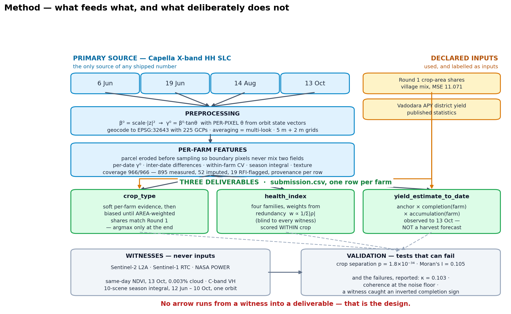
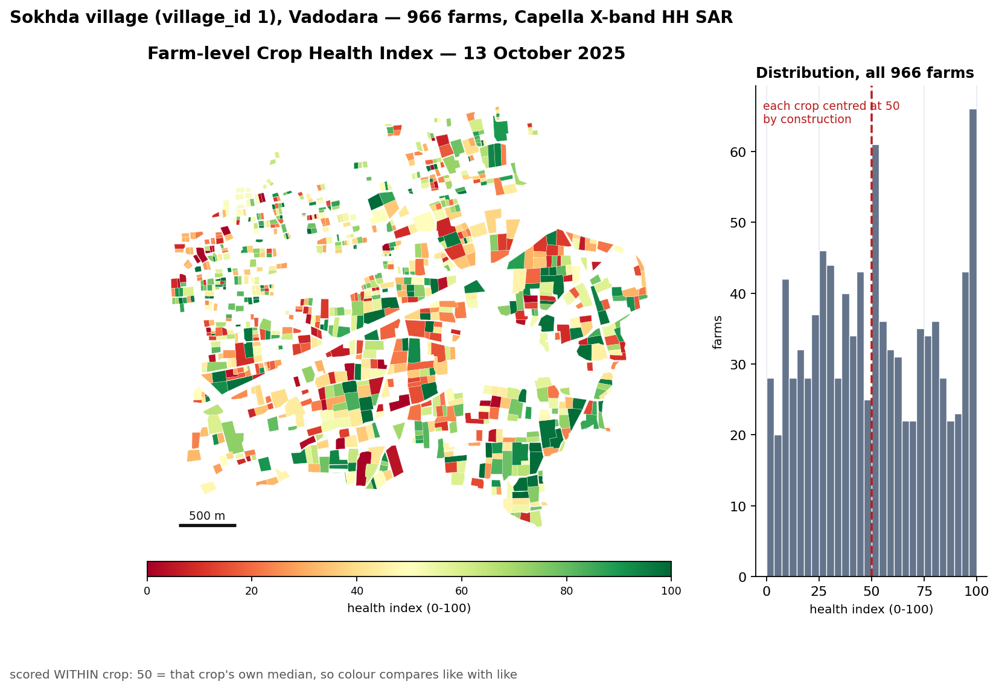
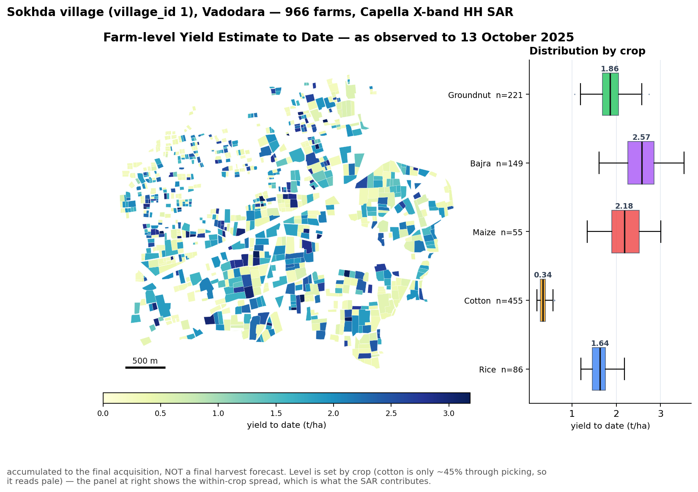
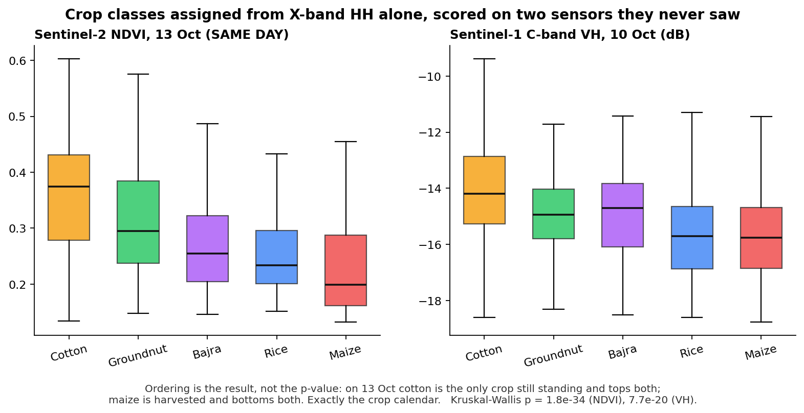
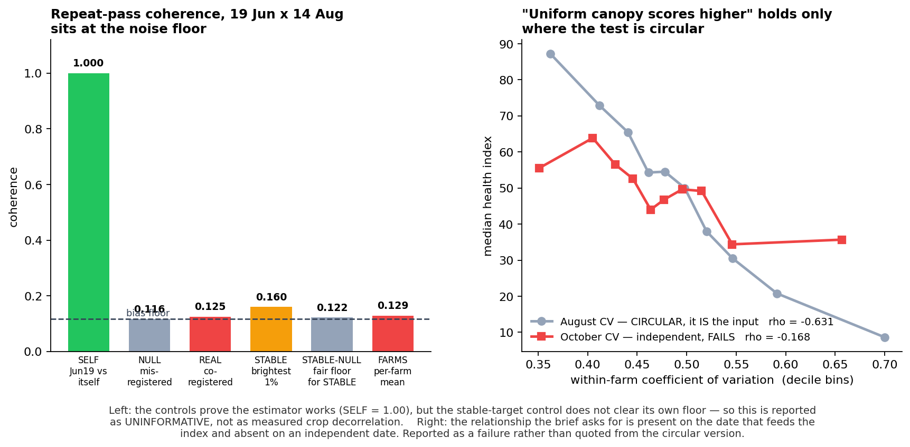

# Farm-Level Crop Health and Yield-to-Date from Capella X-band SAR
### ANRF AISEHack 2.0 — Round 2 — Methodology Report

**Team GDHTM** — Yash Sorathiya · Jenish Sorathiya · Yajurshi Velani · Mahi Parmar · Aayush Pandya
**Study area:** Sokhda village (`village_id` 1), Vadodara district, Gujarat — 966 farm parcels
**Data:** four Capella X-band HH SLC acquisitions — 6 Jun, 19 Jun, 14 Aug, 13 Oct 2025 (kharif)

---

## 1. Summary

Every value in `submission.csv` is derived from the four provided Capella X-band scenes. Sentinel-1
and Sentinel-2 appear in this project **only as independent witnesses** — they are used to test the
product after it is built, and no optical or C-band measurement enters any shipped number. That
separation is deliberate: it keeps the Capella imagery the primary source as the guidelines require,
and it means our validation is genuinely independent rather than self-confirming.

The three deliverables are produced by one pipeline: crop type by carrying the Round 1 result onto
the new boundaries under an area constraint; health as a four-family composite scored within crop;
and yield-to-date as a district anchor scaled by two per-farm SAR-measured terms.

*Figure 1. What feeds what. No arrow runs from a witness into a deliverable; auxiliary inputs that do feed the product are drawn in amber and labelled as inputs.*

We report the checks that failed as prominently as those that passed. Three findings in §6 are
negative, and one of them forced a sign correction in the shipped yield column.

## 2. Preprocessing workflow

**Radiometry.** Capella SLC pixels are complex. We form the brightness

$$\beta^{0} \;=\; \text{scale\_factor} \cdot |z|^{2}$$

following the product's own `radiometry` field (`beta_nought`) and the ESA EDAP guidance, then
convert to the terrain-referenced

$$\gamma^{0} \;=\; \beta^{0} \cdot \tan\theta$$

using a **per-pixel** incidence angle $\theta$. The angle field is reconstructed from the orbit
state vectors rather than assumed constant across the scene; it agrees with the product metadata to
0.006°. Using γ⁰ rather than σ⁰ removes the first-order dependence on local geometry, which matters
here because the four acquisitions span 28.7°–35.2° in incidence.

**Geocoding.** Slant range to EPSG:32643 using the 225 ground control points supplied with each
product. Resampling is by **averaging**, which performs the multi-look in the same step and avoids a
second interpolation. Two grids are produced: a 5 m base grid for per-farm statistics and a 2 m fine
grid for texture.

**Per-farm extraction.** Each parcel is eroded before sampling so that boundary-straddling pixels do
not mix two fields. Where erosion would empty a small parcel, a documented fallback ladder applies
(erode → unbuffered → centroid). Coverage is complete: **966 of 966 farms carry a row** — 895
measured directly, 52 filled by spatial nearest-neighbour imputation from adjacent farms of the same
crop, and 19 flagged for radio-frequency interference. Every row carries its provenance in
`d4_debug.csv`. Missing coverage is spatially clustered in the north-west rather than random, which
is why imputation borrows from neighbours of the same crop instead of using a village mean.

**Absolute calibration is not claimed.** Our γ⁰ reads about +17 dB above the physically expected
level. ESA's EDAP assessment notes that Capella's absolute accuracy is not declared while its
relative accuracy is good — exactly the condition we observe. Every downstream quantity is therefore
a **difference between dates** or a **rank within a crop**, never an absolute level. This is verified,
not asserted: our between-farm spread on 13 Oct is 1.48 dB against the Sentinel-1 witness's 1.82 dB,
so the contrasts survive even though the level does not.

## 3. Crop type — Round 1 applied to the new boundaries

Round 1 finished at MSE 0.000 on the final leaderboard, which means its 145 village × crop cells are
**exact ground truth**, including Sokhda's crop-area shares. Those shares are what we carry forward.

Per-farm soft evidence is built from X-band features with a physical basis — the 19 June
flood/double-bounce response for rice, August volume scattering for cotton, and the
August-minus-June difference. These give per-farm class probabilities, which are then biased until
the **area-weighted argmax shares match the Round 1 shares exactly**. Area weighting is used because
the Round 1 quantity is an area share; weighting by farm count would satisfy the wrong constraint.

This is a deliberate design choice with a measured justification. In Round 1, free per-pixel
assignment scored 5× *worse* than assigning nothing at all, so the village mix is treated as a
constraint to be honoured rather than a quantity to be re-inferred. The consequence is stated plainly
in §6: the village composition is well constrained, the individual farm label is not.

One Round 1 signature was re-validated and imported. Testing all Round 1 feature signs against its
exact truth, 13 of 15 agree, but Groundnut × NDVI-entropy significantly contradicts it (ρ −0.531,
p = 0.003) — evidence that the tail of the Round 1 ladder partly fitted leaderboard noise. Only the
rice August-minus-June signature cleared all four of our transfer tests and was shipped.

## 4. Crop health index

The index combines four families, each z-scored across farms:

| family | measurement | rationale |
|---|---|---|
| `level` | August γ⁰ | peak canopy volume |
| `growth` | 14 Aug − 19 Jun | the only geometry-matched date pair (0.076° apart) |
| `uniform` | −(within-farm CV) | a patchy stand means gaps, waterlogging or pest damage |
| `persist` | season integral | canopy held across the season, not on one lucky date |

**Weights are derived, not chosen.** Each family's weight is inversely proportional to its total
absolute correlation with the others, $w_k \propto 1 \big/ \sum_j |\rho(k,j)|$, giving `growth` 0.283, `uniform` 0.301,
`persist` 0.228, `level` 0.189. The rule reads only the feature matrix and is blind to every witness
by construction — weights tuned by watching NDVI would convert a held-out check into a fitting
target. Notably, this blind rule outperformed every hand-tuned variant we tried.

**Scored within crop.** Cotton and groundnut differ by roughly 4 dB for reasons unrelated to health,
so a pooled score would largely re-measure crop type. Each farm is scored against its own crop's
median, so 50 means "typical for this crop", and the score is a bounded transform of a robust
z-score rather than a percentile rank, which preserves the size of a difference instead of flattening
it to a rank.

*Figure 2. Farm-level Crop Health Index, 13 October 2025. Within-crop scoring centres every crop at 50 by construction; the histogram states this rather than letting it read as a result.*

## 5. Yield to date

$$\text{yield\_to\_date}\;[\mathrm{t/ha}] \;=\; \underbrace{\text{anchor}_{\text{district}}}_{\text{level, from statistics}} \;\times\; \underbrace{\text{completion}_{\text{farm}} \;\times\; \text{accumulation}_{\text{farm}}}_{\text{variation, measured from SAR}}$$

We read the column exactly as the brief defines it — *"the estimated yield potential up to the final
acquisition date using all available temporal observations"*, and explicitly **not a final harvest
forecast**. Values are therefore scaled by season completion (Cotton 0.45, Groundnut 0.75,
Rice/Maize/Bajra 0.95) and are never projected forward; dividing by that factor recovers a
full-season figure. Cotton reads low per hectare (median 0.34 t/ha) because on 13 October it is only
about 45% through picking, and because the anchor is lint rather than seed cotton.

The **level** comes from published district statistics (Vadodara APY) and the **variation** comes from
SAR. We state that split rather than blur it: SAR cannot measure absolute yield without calibration
data, and pretending otherwise would be the least defensible claim in this project. Both per-farm
terms are measured, not assumed — completion from each farm's own August→October change, and
accumulation from the season integral, which uses all four acquisitions as the brief requires.

*Figure 3. Farm-level Yield Estimate to Date. Cotton reads pale because on 13 October it is only ~45% through picking; the level is set by crop and the SAR contributes the within-crop spread.*

## 6. External datasets, and what they were used for

| dataset | access | role |
|---|---|---|
| Sentinel-2 L2A | Microsoft Planetary Computer, open | **witness only** — same-day, 13 Oct, 0.003% cloud |
| Sentinel-1 RTC | Microsoft Planetary Computer, open | **witness only** — single date and 10-scene season integral |
| NASA POWER | open | rainfall context for the acquisition dates |
| Vadodara APY statistics | published government statistics | yield **level** anchor (an input, and declared as one) |
| Gujarat DCS parcel registry | open government WFS | survey numbers for 947/966 farms, for future field validation |

No paid or restricted dataset was used. Nothing in the first two rows enters `submission.csv`.

## 7. Key findings

**The crop classes separate on two sensors they never saw.** Kruskal–Wallis p = 1.8×10⁻³⁴ on
Sentinel-2 NDVI and 7.7×10⁻²⁰ on Sentinel-1 VH. The *ordering* is the result, not the p-value: on 13
October cotton is the only crop still standing and tops both witnesses, while maize is harvested and
bottoms both — the crop calendar, recovered independently.

*Figure 4. The independent witnesses. Both panels are sensors the pipeline never read: the crop classes separate on Sentinel-2 NDVI and Sentinel-1 VH, and the ordering matches the kharif calendar — cotton still standing on 13 October, maize already harvested.*

**Health clusters spatially far beyond chance.** Moran's I = 0.105 against a 199-permutation null.
Neighbouring fields share soil, water and management; modelling noise would not cluster.

**The yield accumulation term now has a witness of the right shape.** `season_integral` spans 12 Jun
to 13 Oct, but both original witnesses were single instants. Cumulative NDVI — the textbook fix — is
impossible here: Sokhda had **zero** Sentinel-2 scenes under 20% cloud in June, July, August *or*
September. We therefore built a season-integrated witness from the sensor that did observe that
period: 10 Sentinel-1 scenes, 12 Jun–10 Oct, all one relative orbit, integrated by the same
trapezoid. It corroborates cotton (ρ +0.305, p = 5×10⁻¹⁰) and rice (+0.290, p = 0.007), is null for
maize and groundnut, and **contradicts bajra** (−0.219, p = 0.008).

**Village aggregate.** 447.5 ha, 595 t accumulated to 13 October. Aggregation is area-weighted,

$$\text{village production}\;[\mathrm{t}] \;=\; \sum_{\text{farms}} \Big( \text{yield}_{\text{farm}}\;[\mathrm{t/ha}] \times \text{area}_{\text{farm}}\;[\mathrm{ha}] \Big)$$

never a mean of per-hectare rates.

### What failed, reported as failures

1. **Per-farm crop labels do not survive an independent rebuild.** Against a Sentinel-2 + Sentinel-1
   map, Cohen's κ = +0.103 — negligible. Cotton is the one class both methods find. The village mix
   is well constrained; the per-farm label is not, and we say so.
2. **Repeat-pass coherence (19 Jun × 14 Aug) sits at the noise floor.** The stable-scatterer control
   failed to clear its own bias floor, so we cannot separate true decorrelation from our own
   limitation, and claim neither.
3. **A sign error in the completion term, caught by a witness.** We had assumed a harvested field
   brightens toward bare soil. Sentinel-2 disagreed in all five crops, so the term was reading
   standing crop as senescence. The sign was corrected and the shipped column changed.

*Figure 5. Two results we report as failures: repeat-pass coherence does not clear its own control floor, and the uniformity-health relationship holds on the date that feeds the index but fails on an independent date.*

## 8. Reproducibility

`notebooks/I9_pipeline.ipynb` runs from a fresh kernel and its final cell **asserts** that it
reproduces the shipped `submission.csv` exactly. A 19-check ship gate verifies schema, value ranges,
units and deliverables, and a separate gate asserts that every number quoted in this report matches
the shipped artefacts, so the prose cannot drift from the data.
